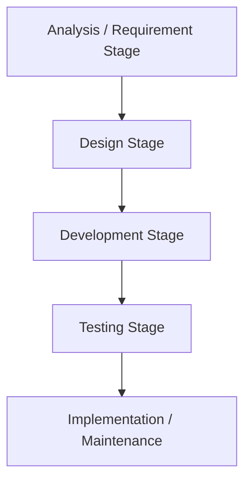
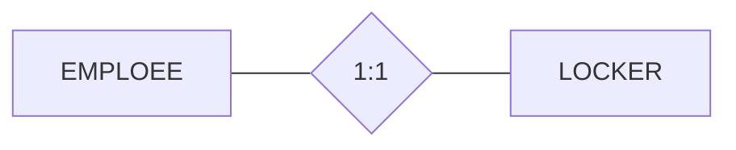
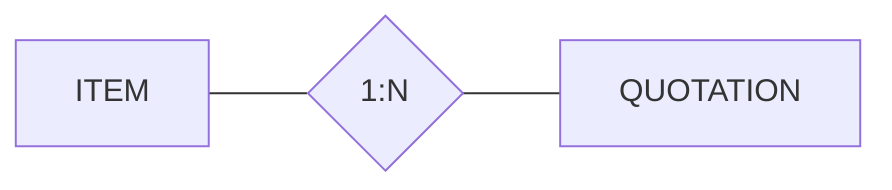
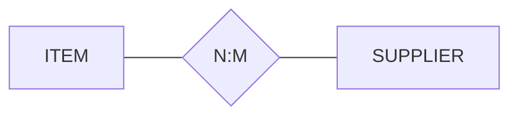

## Systems Development Life Cycle (SDLC) Model

### Requirement Analysis Stage

Sources of requirements:

- User Interviews
- Forms
- Reports
- Queries
- Use Cases
- Business Rules
  - Flow Chart
  - Activity Diagram

## Three Stages of Database Development

- **Requirement Analysis Stage**
- **Component Design Stage**
- **Implementation Stage**

They are part of SDLC model.

## Entity Relationship (E-R) Model

### Important Elements

- **Entities**
- **Attributes**
- **Identifiers**
- **Relationships**

### Entity

**Entity Class** is a description of the structure and format of the occurrences of the entity.

**Entity Instance** is a specific occurrence of an entity within an entity class.

### Attributes

Attributes describe characteristics of entities.

Attributes have a data type and properties.

### Identifiers

Entity instances have identifiers.

An identifier will identify a particular instance in the entity class.

#### Identifier Types

- **Uniqueness**
  - Identifiers may be unique or non-unique.
  - If the identifier is unique, then the data value for the identifier must be unique for all instances.
- **Composite**
  - A composite identifier consists of two or more attributes.

### Relationships

Entities can be associated with one another in relationships.

Relationship degree defines the number of entity classes participating in the relationship:

- Degree 1 is a **unary relationship**.
- Degree 2 is a **binary relationship**.
- Degree 3 is a **ternary relationship**.

#### Maximum Cardinality

It is the maximum number of entity instances that may participate in a relation instance.

##### 1:1 (One-to-One)

A single entity instance in one entity class is related to a single entity instance in another entity class.

##### 1:N (One-to-Many)

A single entity instance in one entity class is related to many entity instances in another entity class.

##### N:M (Many-to-Many)

Many entity instances in one entity class are related to many entity instances in another entity class

#### Minimum Cardinality

It is the minimum number of entity instances that must participate in a relationship instance.

These values typically assume a value of zero (optional) or one (mandatory).
