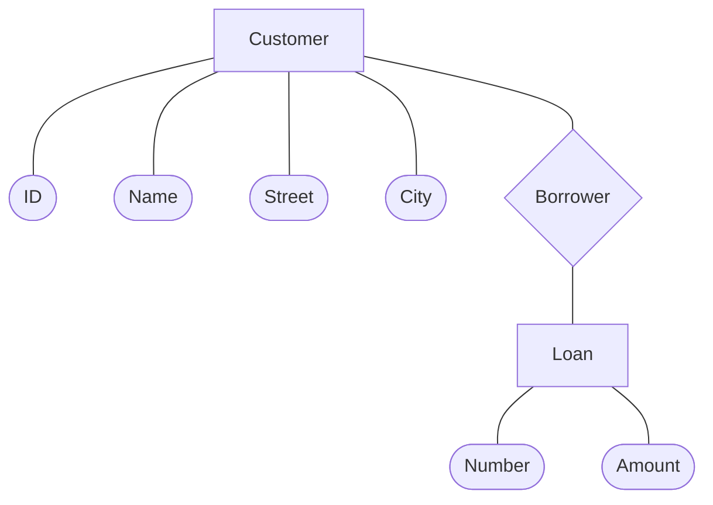

## Database System Concepts

- **Data**: Information stored in a structured form.
- **Database**: A structured collection of data stored electronically.
- **Database Management System (DBMS)**: A software system used to manage databases and allows users to interact with data.
- **Database Model**: The way data is logically structured and represented such as relational, NoSQL, etc.
- **Queries**: A way to retrieve or manipulate data using languages like SQL.

## Data Schema

A data schema defines the structure and organization of data within a database.

- **Entity**: A definable thing.
- **Attribute**: A property or characteristic of an entity.
- **Relationship**: How entities are associated with each other.
- **Relation**: A relation is a table with columns and rows.
- **Tuple**: A tuple is a row of a relation.
- **Cardinality**: The cardinality of a relation is the number of tuples it contains.

### Characteristics of a Relation

1. Rows contain data about an entity.
2. Columns contain data about attributes of the entity.
3. Cells of the table hold a single value.
4. All entries in a column are of the same kind.
5. Each column has a unique name.
6. The order of the columns is unimportant.
7. The order of the rows is unimportant.
8. No two rows may be identical.

## Entity Relationship (ER) Diagram

An ER diagram is a type of flowchart, illustrating how entities related to each other within a system.

### Shapes

1. Rectangles represent entity sets.
2. Diamonds represent relationship sets.
3. Lines link attributes to entity sets and entity sets to relationship sets.
4. Ellipses represent attributes
   - Double ellipses represent multivalued attributes.
   - Dashed ellipses denote derived attributes.
5. Underline indicates primary key attributes

**Example**:

## Key

A key is a or more columns of a relation used to identity a row.

### Unique Key

- **Unique Key**
  - Data value is unique for each row.
  - The key will identify a row uniquely.
- **Non-Unique Key**
  - Data value may be shared among several rows.
  - The key will identify a set of keys.

### Composite Key

A Composite key is a key contains two or more attributes.

A unique key must often become a composite key.

For example, `First Name` and `Last Name` can be grouped as a composite key.

### Candidate Key

A candidate key is a candidate to become the primary key. So a candidate key is a unique key.

### Primary Key

A primary key is a candidate key chosen to be the main key for the relation.

It is able to identify a single row uniquely by knowing the value of the primary key.

### Surrogate Key

A surrogate key is a unique and numeric value added to a relation to serve as the primary key.

They have no meaning to users and are usually hidden on forms, queries, etc.

In addition, a surrogate key is often used in place of a composite primary key.

### Foreign Key

A foreign key is used to preserve relationships.

A foreign key is usually a primary key from one table placed into another table.

#### Referential Integrity

It states that every value of a foreign key must match a value of an existing key.

## `NULL` Value

A `NULL` value means no data was entered, which may have entirely different implications.

A `NULL` is often ambiguous because it could mean:

- The column value is not appropriate for the specific row.
- The column value is not decided.
- The column value is unknown.
- ...

## Database Architecture

### 1-Tier Architecture

The database is directly available to the user, which is typically for local applications.

- The data is not frequently updated.
- Multiple users are not accessing the database.
- A direct and simple method of modifying or accessing the database is required for application development.

### 2-Tier Architecture

The database resides on a serer, and a client application accesses the data through DBMS, which is common for small applications.

- It is possible to use it simultaneously by multiple users, thus making it suitable for use within an organization.
- Due to the database functionality being handled solely by the server, it has a high processing capability.
- Direct connection and enhanced performance provide faster access to the database.
- Having two independent layers makes it easier to maintain

### 3-Tier Architecture

It involves a client or user interface, application server, and database server, which is common for enterprise systems.

- **Database (Data) Tier**:
  - This is where the actual database is stored and managed.
- **(Middle) Tier**:
  - This layer contains the application or software that connects the user to the database.
- **User (Presentation) Tier**:
  - This is the part the user interacts with, like a web interface or app. The user doesn’t see or know about the database behind it.
