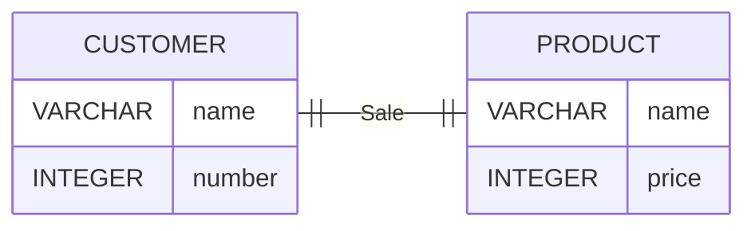
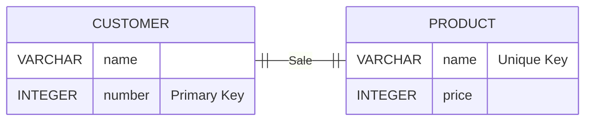

## Business Rules

A business rule is a **brief**, **precise**, and **unambiguous** description of a **policy**, **procedure**, or **principle** within a specific **organization**.

It is derived from a detailed description of an organization's operations which help to create an enforce actions within the organization's environment.

And it must be rendered in writing and updated to reflect any changes in the organization.

To be effective business rules must be easy to understand.

### Sources

- Company Managers
- Policy Makers
- Department Managers
- Written Documentation
- Direct Interview with End Users

### Reasons

- Help standardize company's view of data.
- Communications tool between users and designers.
- Allow designer to:
  - Understand the **nature**, **role**, **scope of data**, and **business processes**.
  - Develop appropriate relationship participation rules and constraints.
  - Create an accurate data model.

## From Business Rules to Data Model Components

| Word in the Business Rule | Component    |
| ------------------------- | ------------ |
| Nonu                      | Entity       |
| Verb                      | Relationship |

The data model relationships are bidirectional, meaning they go both ways.

## Data Models in DBMS

The data model is defined as an abstract model the organized **data description**, **data semantics**, and **consistency constraints of data**.

### Types of Data Modeling Technique

1. Entity Relationship (E-R) Model
2. UML (Unified Modelling Language)

### Why Using Data Model

1. Ensure the accuracy of data objects.
2. Help to design the database at the conceptual, physical and logical levels.
3. Help to define the relational tables, primary and foreign keys, and stored procedures.
4. Guide developers to create a physical database.
5. Help to identify missing and redundant data.
6. Enable IT infrastructures to be upgraded and maintained with lower cost and higher efficient.

### Types

#### Conceptual Data Model (Domain Model)

It gives designers an overview of the system without being concerned with the details of implementation.

It is a simplified diagram of the final database, with the details ignored, so the big picture can be understood.

Example:

It has the following characteristics:

- Offer organization-wide coverage of the business concepts.
- They are designed and developed for business audiences.
- It focuses to represent data as a user will see in the real world.
- Create a common vocabulary for all stakeholders by establishing basic concepts and scope.

In short, it is:

- Highly abstract
- Easily understood
- Easily enhanced
- Only "entities" visible
- Abstract relationships

#### Logical Data Model

It defines the structure of data elements and to set relationships between them.

It adds further information to the conceptual data model elements.

It provides a foundation to form the physical model, but it remains generic since it does not define primary and secondary keys.

Example:

It has the following characteristics:

- Designed and developed independently from the DBMS.
- Data attributes will have data types with exact precision and length.

In short, it is:

- Presence of attributes for each Entity
- Key attributes
- Non-key attributes
- User friendly attributes names
- Primary key — foreign key relationships
- More detailed than conceptual model
- Bit more effort required to enhance, in comparison to conceptual model

#### Physical Data Model

It describes a database-specific implementation of the data model, which offers database abstraction and helps generate the schema.

It also helps in visualizing database structure by replicating database column **keys**, **constraints**, **indexes**, **triggers**, and other **RDBMS features**.

Example:

Characteristics:

- Developed for a specific version of a DBMS, location, data storage or technology to be used in the project.
- Columns should have exact data types, lengths, and default values.

In short:

- Entities referred to as Tables
- Attributes referred as columns
- Database compatible table names
- Database compatible column names
- Database specific data types
- Difficult to user to understand
- Significantly more effort required to enhance in comparison to Logical Model.
- Include indexes, constraints, triggers and other DB Objects.

#### Conclusion

| ERD Features | Conceptual | Logical | Physical |
| ------------ | ---------- | ------- | -------- |
| Entity       | ✅         | ✅      | ✅       |
| Attributes   | ❌         | ✅      | ✅       |
| Relationship | ✅         | ✅      | ✅       |
| Data Type    | ❌         | ❌      | ✅       |
| Primary Key  | ❌         | ✅      | ✅       |
| Foreign Key  | ❌         | ❌      | ✅       |

| Data Model | Definition                                               | Created by                                 | Purpose                                                 |
| ---------- | -------------------------------------------------------- | ------------------------------------------ | ------------------------------------------------------- |
| Conceptual | `WHAT` the system contains.                              | Business Stakeholders and Data Architects. | Organize, scope and define business concepts and rules. |
| Logical    | `HOW` the system should be implemented without DBMS.     | Data Architects and Business Analysts.     | Develop technical map of rules and data structures.     |
| Physical   | `HOW` the system will be implemented with specific DBMS. | DBA and Developers.                        | Implement the database actually.                        |
