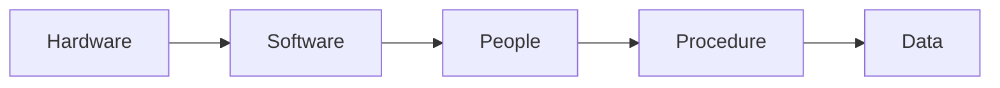

## Data VS. Information

- **Data**:
  - Raw facts.
  - Unprocessed information.
- **Information**:
  - Data processed to reveal meaning.
  - Data with context.

Accurate, relevant, and timely information is key to good decision-making.

| Parameters     | Data                                                | Information                                                              |
| -------------- | --------------------------------------------------- | ------------------------------------------------------------------------ |
| Format         | Numbers, letters, or a set of characters. Raw data. | Ideas and inferences. Data with context.                                 |
| Represented in | Tabular data, graph, data tree, etc.                | Language, ideas, and thought based on the given data.                    |
| Meaning        | Data have no specific purpose.                      | Information carries meaning that has been assigned by interpreting data. |
| Contains       | Unprocessed raw factors.                            | Processed in a meaningful way.                                           |
| Dependency     | Data depends on the sources for collecting data.    | Information depends on data.                                             |

## What Data to Store

### Types of Data

1. Raw data
2. Pre-processed
3. Compressed

### Sensor Data

The frequency of data storage for sensor data is a trade-off between precision and quantity.

### Database

Database is a shared, integrated computer structure that stores:

1. End user data (raw facts).
2. Metadata. (data about data).

## Files and File Systems

Managing data with file systems is obsolete.

There are some problems with file system data management:

- Time-consuming, high-level activity.
- As number of files expands, the system will be difficult to be managed.
- Making changes in existing file structure is difficult.
- File structure changes requires modifications in all programs that use data in that file.
- Modifications are likely to produce errors, which requires additional time to debug programs.
- It is hard to be secure.

## Data Redundancy

Data redundancy results in data inconsistency and errors.

### Types of Data Anomalies

- **Update anomalies**: Occur when changes must be made to existing records.
- **Insertion anomalies**: Occur when entering new records.
- **Deletion anomalies**: Occur when deleting records.

## Database System Structure

### Database System VS. File System

**File system** has many separate and unrelated files.

**Database system** has logically related data stored in a single logical data repository.

## Database System Composition

Database system is composed of five main parts.

### Hardware

Hardware is the physical parts of the computer.

It includes **storage devices** like hard disks and **input-output devices** like monitors, printers, etc.

Computers, scanners, and printers are used to capture data, transform them and present them to users as output.

### Software

Software is **a collection or set of programs or instructions** that tell a computer what to do.

It includes **database software**, **operating system**, etc.

### People

People are who control and manage the databases and perform different types of operations on the database in the DBMS.

It includes **database administrator**, **software developer**, and **end-user**.

> **Data administrator**: The one who manages the complete DBMS.

### Procedure

Procedures refer to general instructions to use a database management system (DBMS).

The basic purpose of the procedures is to help guide users in the operation and management of database systems.

### Data

Data covers the collection of facts stored in the database.

## Database Management System (DBMS)

It is a collection of programs that manages database structure and controls access to data.

It is also able to share data among multiple applications or users, and makes data management more efficient and effective.

### Advantages of DBMS

- End users have better access to more and better-managed data.
- Promotes integrated view of organization's operations.
- Reduce the probability of data inconsistency.
- Produce quick answers to ad hoc queries.

### DBMS Functions

DBMS performs functions that guarantee integrity and consistency of data.

1. Data dictionary management.
2. Data storage management.
3. Data transformation and presentation.
4. Security management.
5. Multiuser access control.
6. Backup and recovery management.
7. Data integrity management.
8. Database access languages and application programming interfaces.
9. Database communication interfaces.

## Importance of Database Design

- Defines the expected use of database.
- Different approach needed for different types of databases.
- Avoid redundant data.
- Poorly designed database generates errors.

## File Based VS. Database

| File based                                 | Database                                                |
| ------------------------------------------ | ------------------------------------------------------- |
| Data is distributed and can not be shared. | Data is stored at one place which can be shared easily. |
| It is hard to check data integrity.        | It provides constraints for data integrity.             |
| Poor security as data is widely spread.    | It provides data security.                              |
| Less complex system.                       | Very complex system.                                    |
| Cost is lower than DBMS.                   | Costly system.                                          |
